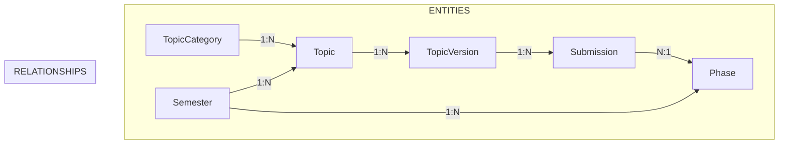
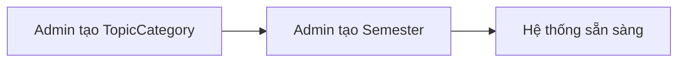
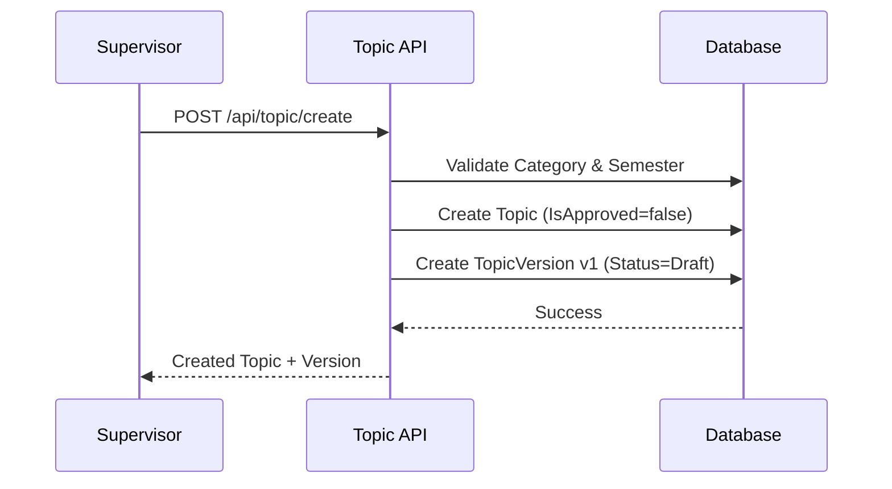
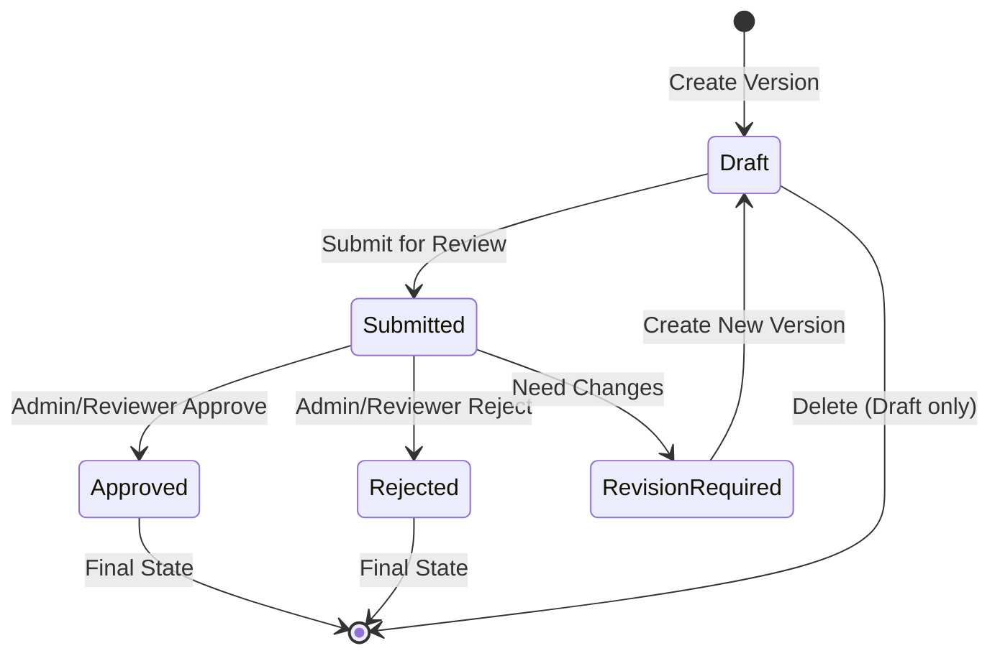
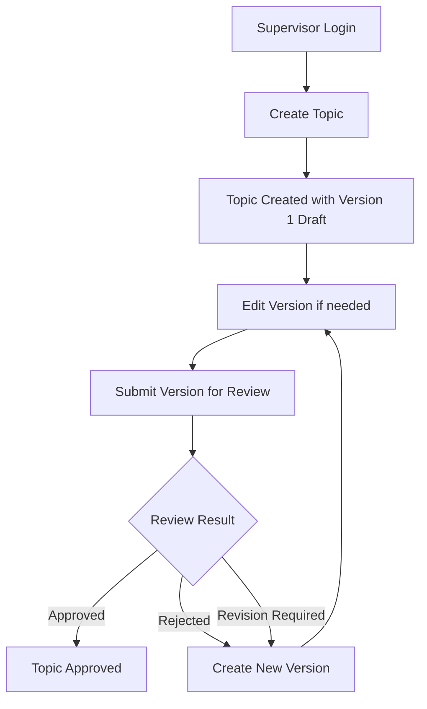
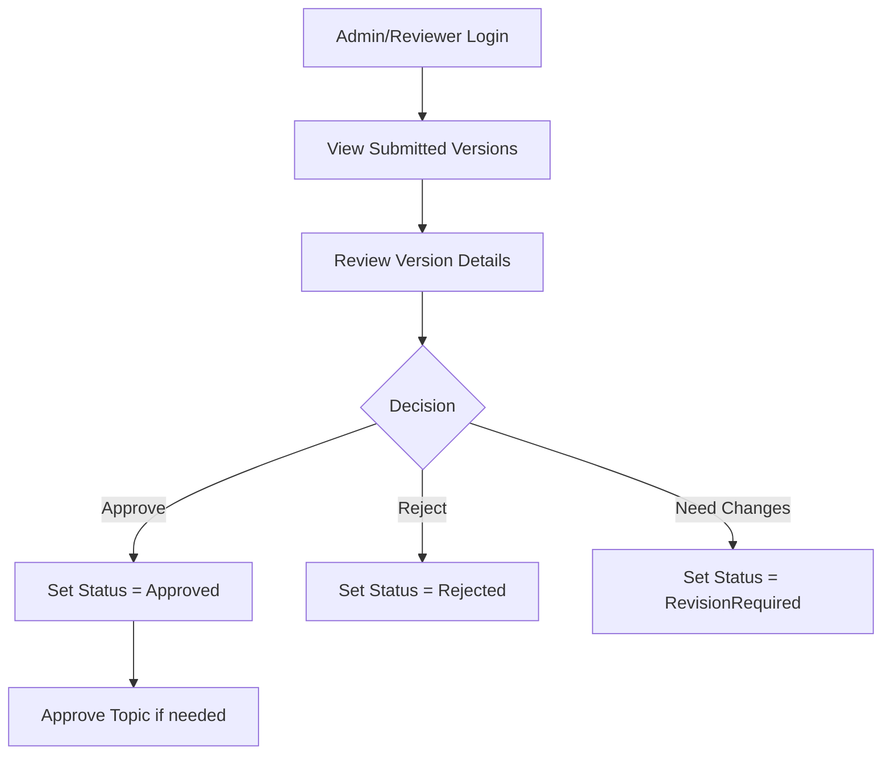
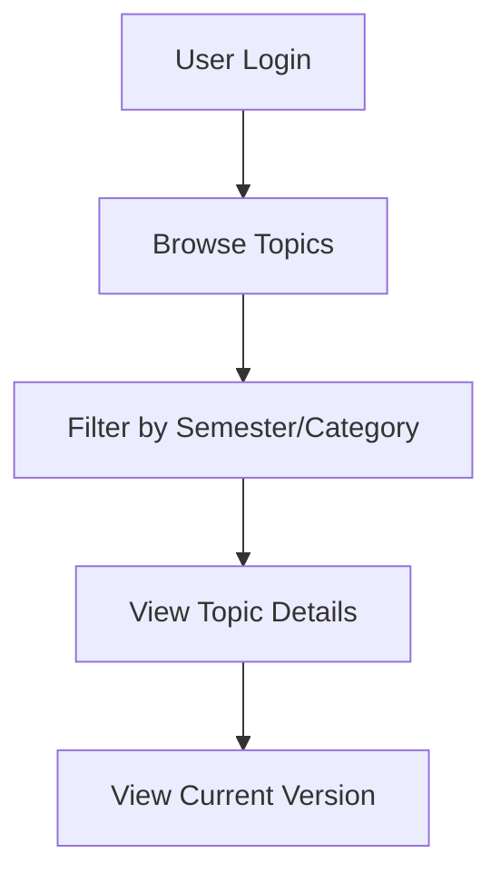

# 📊 WORKFLOW CỦA HỆ THỐNG TOPIC MANAGEMENT

## 🏗️ KIẾN TRÚC TỔNG QUAN



## 🔄 WORKFLOW CHI TIẾT

### 1. **SETUP PHASE - Chuẩn bị hệ thống**



**APIs:**

- `POST /api/topic-category/create` (Admin only)
- `POST /api/semester/create` (Admin only)

---

### 2. **TOPIC CREATION WORKFLOW - Tạo chủ đề**



**Quy trình:**

1. Supervisor tạo Topic với thông tin cơ bản
2. Hệ thống tự động tạo TopicVersion đầu tiên (v1) với status `Draft`
3. Topic được tạo với `IsApproved = false`

---

### 3. **TOPIC VERSION LIFECYCLE - Vòng đời phiên bản**



**Status Flow:**

- **Draft**: Supervisor có thể edit/update/delete
- **Submitted**: Chờ review, không thể edit
- **Approved**: Được phê duyệt, không thể thay đổi
- **Rejected**: Bị từ chối, có thể tạo version mới
- **RevisionRequired**: Cần chỉnh sửa, có thể tạo version mới

---

### 4. **DETAILED API WORKFLOW**

#### 🎯 **A. Supervisor Workflow**



**APIs cho Supervisor:**

- `POST /api/topic/create` - Tạo topic mới
- `GET /api/topic/my-topics` - Xem topics của mình
- `PUT /api/topic/update` - Cập nhật thông tin cơ bản topic
- `POST /api/topic-version/create` - Tạo version mới
- `PUT /api/topic-version/update` - Cập nhật version (chỉ Draft)
- `POST /api/topic-version/submit` - Submit version để review
- `DELETE /api/topic-version/delete/{id}` - Xóa version Draft

#### 🎯 **B. Admin/Reviewer Workflow**



**APIs cho Admin/Reviewer:**

- `GET /api/topic/list` - Xem tất cả topics
- `GET /api/topic-version/history/{topicId}` - Xem lịch sử versions
- `POST /api/topic-version/review` - Review version
- `POST /api/topic/approve/{id}` - Approve topic
- `DELETE /api/topic/delete/{id}` - Xóa topic (Admin only)

#### 🎯 **C. Student/Public Workflow**



**APIs cho Users:**

- `GET /api/topic/list` - Xem danh sách topics
- `GET /api/topic/detail/{id}` - Xem chi tiết topic
- `GET /api/topic-version/detail/{id}` - Xem chi tiết version

---

### 5. **BUSINESS RULES & PERMISSIONS**

#### 📋 **Permission Matrix**

| Action         | Supervisor           | Admin | Reviewer | Student |
| -------------- | -------------------- | ----- | -------- | ------- |
| Create Topic   | ✅ (own)             | ✅    | ❌       | ❌      |
| Update Topic   | ✅ (own)             | ✅    | ❌       | ❌      |
| Delete Topic   | ❌                   | ✅    | ❌       | ❌      |
| Approve Topic  | ❌                   | ✅    | ✅       | ❌      |
| Create Version | ✅ (own topic)       | ❌    | ❌       | ❌      |
| Update Version | ✅ (own, Draft only) | ❌    | ❌       | ❌      |
| Submit Version | ✅ (own)             | ❌    | ❌       | ❌      |
| Review Version | ❌                   | ✅    | ✅       | ❌      |
| View Topics    | ✅                   | ✅    | ✅       | ✅      |

#### 🔒 **Business Rules**

1. **Topic Creation**: Tự động tạo Version 1 với status Draft
2. **Version Editing**: Chỉ Draft versions có thể edit
3. **Version Submission**: Chỉ Draft versions có thể submit
4. **Version Review**: Chỉ Submitted versions có thể review
5. **Version Deletion**: Chỉ Draft versions có thể delete
6. **Topic Approval**: Admin có thể approve topic bất kỳ lúc nào
7. **Version Numbering**: Tự động increment (1, 2, 3, ...)

---

### 6. **API ENDPOINTS SUMMARY**

#### 🏷️ **Topic Management**

```
POST   /api/topic/create              # Tạo topic mới
GET    /api/topic/list                # Danh sách topics với paging
GET    /api/topic/detail/{id}         # Chi tiết topic
PUT    /api/topic/update              # Cập nhật topic
DELETE /api/topic/delete/{id}         # Xóa topic (Admin)
POST   /api/topic/approve/{id}        # Approve topic (Admin)
GET    /api/topic/my-topics           # Topics của supervisor
```

#### 📝 **Topic Version Management**

```
POST   /api/topic-version/create      # Tạo version mới
PUT    /api/topic-version/update      # Cập nhật version
GET    /api/topic-version/history/{topicId}  # Lịch sử versions
GET    /api/topic-version/detail/{id} # Chi tiết version
POST   /api/topic-version/submit      # Submit version
POST   /api/topic-version/review      # Review version
DELETE /api/topic-version/delete/{id} # Xóa version
```

#### 📂 **Topic Category Management**

```
POST   /api/topic-category/create     # Tạo category (Admin)
GET    /api/topic-category/all        # Danh sách categories
PUT    /api/topic-category/update     # Cập nhật category (Admin)
DELETE /api/topic-category/delete/{id} # Xóa category (Admin)
```

---

### 7. **INTEGRATION POINTS**

#### 🔗 **Related Systems**

- **Semester Management**: Topics thuộc về Semesters
- **User Management**: Supervisor, Admin, Reviewer roles
- **Submission System**: TopicVersions có Submissions
- **Phase Management**: Submissions thuộc về Phases
- **Review System**: Versions được review qua workflow

#### 📊 **Data Flow**

```
TopicCategory → Topic → TopicVersion → Submission → Review
      ↑           ↑         ↑            ↑          ↑
   (Admin)   (Supervisor) (Supervisor) (Student) (Reviewer)
```

Workflow này đảm bảo:

- **Tính nhất quán**: Mỗi Topic có ít nhất 1 Version
- **Kiểm soát chất lượng**: Workflow approval rõ ràng
- **Phân quyền rõ ràng**: Mỗi role có permissions phù hợp
- **Truy xuất nguồn gốc**: Audit trail đầy đủ
- **Tính linh hoạt**: Có thể tạo nhiều versions để cải thiện